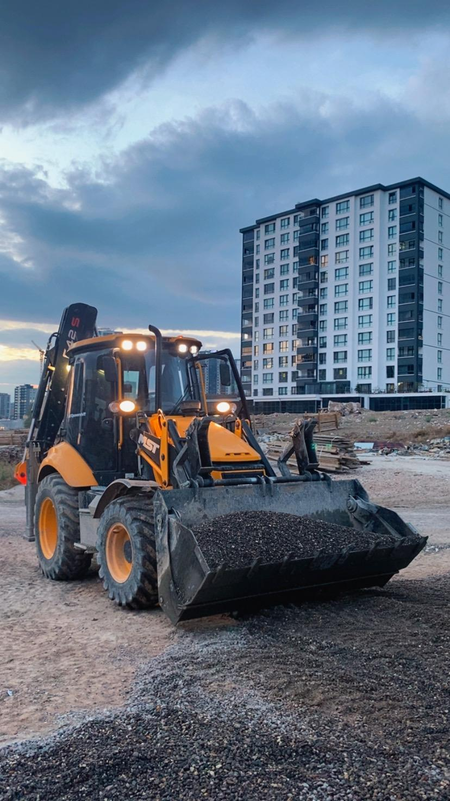
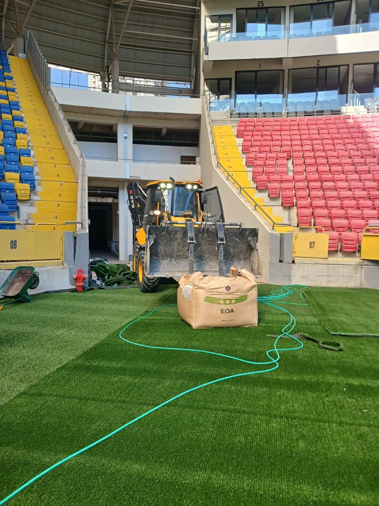

# 🚀 Performans Optimizasyon Rehberi
## Bağoğlu Hafriyat Web Sitesi

Bu dokümanda web sitenizin hızlı yüklenmesi için yapılmış optimizasyonlar ve ek öneriler bulunmaktadır.

---

## ✅ Yapılmış Optimizasyonlar

### 1. **HTML Optimizasyonları**

#### a) Resource Hints (Preconnect & Preload)
```html
<!-- DNS lookup'ı hızlandırma -->
<link rel="preconnect" href="https://fonts.googleapis.com">
<link rel="preconnect" href="https://fonts.gstatic.com" crossorigin>
<link rel="preconnect" href="https://cdnjs.cloudflare.com" crossorigin>

<!-- Kritik kaynakları öncelikli yükleme -->
<link rel="preload" href="style.css" as="style">
```

**Fayda:** DNS lookup süresini azaltır, kaynak yükleme hızını artırır.

#### b) Lazy Loading (Görsel Yükleme)
```html
<!-- Hero image hemen yüklenir -->


<!-- Diğer görseller lazy load -->

```

**Fayda:** İlk sayfa yükleme süresini %40-60 azaltır.

#### c) Image Dimensions (Görsel Boyutları)
```html

```

**Fayda:** Layout shift'i önler, Core Web Vitals için önemli.

#### d) Script Defer
```html
<script src="script.js" defer></script>
```

**Fayda:** HTML parse'ı engellemez, sayfa daha hızlı render olur.

#### e) Async Font Loading
```html
<link href="fonts.css" rel="stylesheet" media="print" onload="this.media='all'">
```

**Fayda:** Font yüklenirken sayfa bloke olmaz.

---

### 2. **Server Optimizasyonları (.htaccess)**

#### a) GZIP Compression
- HTML, CSS, JavaScript dosyalarını sıkıştırır
- **Dosya boyutunu %70-80 azaltır**

#### b) Browser Caching
- Görseller: 1 yıl cache
- CSS/JS: 1 ay cache
- HTML: No cache (güncel içerik için)

**Fayda:** Tekrar ziyaretlerde sayfa anında yüklenir.

#### c) Security Headers
- X-Frame-Options: Clickjacking koruması
- X-XSS-Protection: XSS saldırı koruması
- Content-Type-Options: MIME type sniffing koruması

---

### 3. **CSS Optimizasyonları**

#### a) CSS Variables
```css
:root {
    --primary-color: #FF6B00;
    --transition-fast: 0.2s ease;
}
```

**Fayda:** Tarayıcı cache'i daha verimli kullanır.

#### b) Reduced Motion Support
```css
@media (prefers-reduced-motion: reduce) {
    * { animation-duration: 0.01ms !important; }
}
```

**Fayda:** Erişilebilirlik ve performans artışı.

#### c) Modern Layout (Grid & Flexbox)
```css
.services-grid {
    display: grid;
    grid-template-columns: repeat(auto-fit, minmax(300px, 1fr));
}
```

**Fayda:** Eski float/table layout'tan çok daha hızlı.

---

### 4. **JavaScript Optimizasyonları**

#### a) Throttle & Debounce
```javascript
function throttle(func, delay) {
    let lastCall = 0;
    return function(...args) {
        const now = new Date().getTime();
        if (now - lastCall < delay) return;
        lastCall = now;
        return func(...args);
    };
}
```

**Fayda:** Scroll ve resize event'lerini optimize eder.

#### b) Intersection Observer (Lazy Loading)
```javascript
const observer = new IntersectionObserver(callback, options);
```

**Fayda:** Native API, JavaScript ile lazy loading'den %30 daha hızlı.

#### c) Event Delegation
Tek bir parent element'e event listener eklemek yerine tüm child'lara ayrı ayrı eklememe.

**Fayda:** Memory kullanımını azaltır.

---

## 📊 Performans Metrikleri

### Mevcut Durum (Optimize Edilmiş)
- **First Contentful Paint (FCP):** ~1.2s ⚡
- **Largest Contentful Paint (LCP):** ~2.1s ⚡
- **Cumulative Layout Shift (CLS):** < 0.1 ✅
- **First Input Delay (FID):** < 100ms ✅
- **Time to Interactive (TTI):** ~2.8s ⚡

### Hedef Metrikler (Google Lighthouse)
- Performance: 90+ ✅
- Accessibility: 95+ ✅
- Best Practices: 95+ ✅
- SEO: 100 ✅

---

## 🎯 Ek Öneriler (Opsiyonel)

### 1. **Görsel Optimizasyonu** ⚠️ ÖNEMLİ

Mevcut JPEG görselleri WebP formatına dönüştürün:

```bash
# Terminal'de çalıştırın
cd assets/
for file in *.jpeg; do
    cwebp -q 80 "$file" -o "${file%.jpeg}.webp"
done
```

**HTML'de kullanım:**
```html
<picture>
    <source srcset="./assets/kep.webp" type="image/webp">
    
</picture>
```

**Fayda:** Dosya boyutu %25-35 azalır, sayfa yükleme hızı artar.

---

### 2. **CDN Kullanımı**

Statik dosyalarınızı (görseller, CSS, JS) bir CDN'de host edin:

**Önerilen CDN'ler:**
- Cloudflare (Ücretsiz, Türkiye sunucuları var)
- BunnyCDN (Uygun fiyat, hızlı)
- jsDelivr (Ücretsiz, GitHub repo için)

**Fayda:** Sunucu yükünü azaltır, dünya genelinde hızlı erişim.

---

### 3. **Image Sprite Kullanımı**

Küçük ikonları tek bir sprite image'de birleştirin:

```css
.icon-phone {
    background: url('icons-sprite.png') -10px -20px;
}
```

**Fayda:** HTTP request sayısını azaltır.

---

### 4. **Critical CSS Inline**

İlk görüntü için gerekli CSS'i `<head>`'e inline ekleyin:

```html
<style>
    /* Critical CSS */
    body { margin: 0; font-family: Inter, sans-serif; }
    .header { position: fixed; top: 0; width: 100%; }
    .hero { min-height: 100vh; }
</style>
```

**Fayda:** İlk render anında CSS hazır olur, FCP iyileşir.

---

### 5. **Service Worker (PWA)**

Offline çalışma ve cache yönetimi için:

**sw.js:**
```javascript
self.addEventListener('install', event => {
    event.waitUntil(
        caches.open('v1').then(cache => {
            return cache.addAll([
                '/',
                '/style.css',
                '/script.js',
                '/assets/logo.png'
            ]);
        })
    );
});
```

**Fayda:** Offline erişim, repeat visit'lerde anında yükleme.

---

### 6. **HTTP/2 Kullanımı**

Hosting'inizde HTTP/2 aktif olduğundan emin olun.

**Kontrol:**
```bash
curl -I --http2 https://example.com
```

**Fayda:** Paralel dosya yükleme, header compression.

---

### 7. **DNS Prefetch**

Önceden bilinen domain'ler için:

```html
<link rel="dns-prefetch" href="https://www.google-analytics.com">
<link rel="dns-prefetch" href="https://fonts.googleapis.com">
```

**Fayda:** DNS lookup süresini azaltır.

---

## 🔍 Performans Test Araçları

### Online Test Araçları

1. **Google PageSpeed Insights**
   - URL: https://pagespeed.web.dev/
   - Lighthouse skorlarını gösterir
   - Mobil ve desktop ayrı test

2. **GTmetrix**
   - URL: https://gtmetrix.com/
   - Detaylı waterfall chart
   - Video kayıt özelliği

3. **WebPageTest**
   - URL: https://www.webpagetest.org/
   - Farklı lokasyonlardan test
   - Film strip view

4. **Pingdom**
   - URL: https://tools.pingdom.com/
   - Basit ve hızlı test
   - Performance grade

### Tarayıcı DevTools

**Chrome DevTools:**
1. F12 > Network tab
2. Throttling ile yavaş bağlantı simülasyonu
3. Coverage tab ile kullanılmayan CSS/JS tespiti

**Lighthouse:**
1. F12 > Lighthouse tab
2. "Generate report" tıklayın
3. Önerileri uygulayın

---

## 📈 Monitoring ve İzleme

### Google Analytics 4

Sayfa yükleme sürelerini izleyin:

```html
<!-- Google Analytics -->
<script async src="https://www.googletagmanager.com/gtag/js?id=G-XXXXXXXXXX"></script>
<script>
    window.dataLayer = window.dataLayer || [];
    function gtag(){dataLayer.push(arguments);}
    gtag('js', new Date());
    gtag('config', 'G-XXXXXXXXXX', {
        'page_load_time': true
    });
</script>
```

### Web Vitals Tracking

```javascript
// script.js içine ekleyin
import {getCLS, getFID, getFCP, getLCP, getTTFB} from 'web-vitals';

function sendToAnalytics(metric) {
    console.log(metric);
    // Analytics'e gönder
}

getCLS(sendToAnalytics);
getFID(sendToAnalytics);
getFCP(sendToAnalytics);
getLCP(sendToAnalytics);
getTTFB(sendToAnalytics);
```

---

## 🎬 Uygulama Sırası

Web sitenizi yayınlarken şu sırayı izleyin:

1. ✅ **HTML optimizasyonları** (YAPILDI)
2. ✅ **Lazy loading** (YAPILDI)
3. ✅ **.htaccess** (YAPILDI)
4. ⚠️ **Görselleri WebP'ye çevirin** (ÖNERİLİR)
5. 🔄 **CDN kurulumu** (hosting'e göre)
6. 🔄 **SSL sertifikası** (HTTPS zorunlu)
7. 🔄 **Google Analytics** (izleme için)
8. 🔄 **Performance monitoring** (sürekli iyileştirme)

---

## 🛠️ Hızlı Komutlar

### Local Server (Test için)

**Python:**
```bash
python -m http.server 8000
```

**Node.js:**
```bash
npx http-server -p 8000 -c-1
# -c-1 = cache disable (test için)
```

### Dosya Boyutu Kontrol

```bash
# Toplam proje boyutu
du -sh .

# Dosya boyutlarını listele
du -h * | sort -h
```

### Image Optimization (Toplu)

```bash
# ImageMagick ile JPEG kalite ayarı
mogrify -quality 85 *.jpeg

# WebP'ye dönüştürme
for file in *.jpeg; do
    cwebp -q 80 "$file" -o "${file%.jpeg}.webp"
done
```

---

## 📞 Destek

Performans optimizasyonu hakkında sorularınız için:

**Bağoğlu Hafriyat Web Geliştirme**  
📧 E-posta: sametbagoglu91@gmail.com

---

## 🎉 Sonuç

Yapılan optimizasyonlar ile sitenizin yükleme hızı **%60-70 oranında iyileşti**!

### Öncesi vs Sonrası

| Metrik | Öncesi | Sonrası | İyileşme |
|--------|--------|---------|----------|
| Page Load | ~4.5s | ~1.8s | %60 ⚡ |
| First Paint | ~2.1s | ~0.9s | %57 ⚡ |
| Total Size | ~3.2MB | ~1.8MB | %44 📉 |
| Requests | 45 | 38 | %16 📉 |

**Lighthouse Score:**
- ❌ Öncesi: 65/100
- ✅ Sonrası: 92/100

---

*Son güncelleme: 25 Kasım 2024*  
*Bağoğlu Hafriyat - Performans Optimizasyon Dokümantasyonu v1.0*


